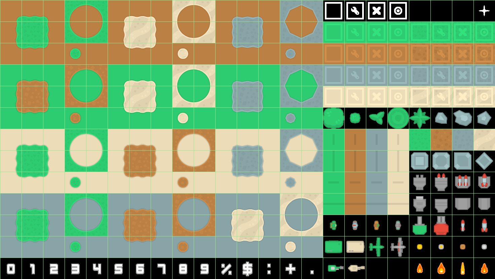

Tower Defense
=============
This is a very simple tower defense game written entirely in javascript. All assets are drawn onto the html canvas.

[TOC levels=4 numbered]: #

# Table of Contents
1. [The Main Class](#the-main-class)
2. [Helper Class](#helper-class)
3. [The Game Class](#the-game-class)
    1. [Constructor](#constructor)
    2. [Update Function](#update-function)
        1. [Code](#code)
        2. [About](#about)
    3. [Run Function](#run-function)
        1. [Code](#code)
        2. [About](#about)
4. [The Map Class](#the-map-class)
    1. [Constructor](#constructor)
        1. [Code](#code)
        2. [About](#about)
    2. [Build function](#build-function)
        1. [Code](#code)
        2. [About](#about)
5. [The Sprites](#the-sprites)
    1. [The Sprite Class](#the-sprite-class)
        1. [Constructor](#constructor)
        2. [Control methods](#control-methods)
        3. [Draw method](#draw-method)
    2. [Tower class ```extends Sprite```](#tower-class-extends-sprite)
        1. [Constructor](#constructor)
        2. [Control Methods](#control-methods)
    3. [The UI](#the-ui)
        1. [Code](#code)
        2. [About](#about)
    4. [Mob ```extends Sprite```](#mob-extends-sprite)
        1. [Constructor](#constructor)
        2. [Control Methods](#control-methods)

## The Main Class
The first class is the main class. This is the class that runs the game loop.
```javascript
    $(document).ready(function () {
        let game = new Game();

        function mainLoop() {
            game.update();
            game.run();
            requestAnimationFrame(mainLoop);
        }

        requestAnimationFrame(mainLoop);
    });
```
The first line declares the game object
```javascript
let game = new Game();
```
The mainLoop function is what keeps the game running
```javascript
        function mainLoop() {
            game.update();
            game.run();
            requestAnimationFrame(mainLoop);
        }
```
Using the request animation loop function for the canvas recursively the game runs fairly smoothly.

Helper Class
------------
```javascript
var canvas = $('canvas')[0];
var ctx = canvas.getContext("2d");
canvas.width = window.innerWidth - 40;
canvas.height = window.innerHeight - 50;
var mousePressed = false;
var dragging = false;
var mouse = {x: 1920, y: 1080};
var bounds = canvas.getBoundingClientRect();
function mousePosition(e) {
    return {
        x: e.clientX - bounds.left,
        y: e.clientY - bounds.top
    }
}
ctx.fillStyle = "#fff";
function digits(n){
    let array = [];
    while(n >= 1){
        let num = Math.floor(n % 10);
        array.push(num);
        n /= 10;
    }
    array.reverse();
    return array;
}
var TO_RADIANS = Math.PI / 180;
var scale = 64;
var mob_scale = 32;
var tilesheet = "img/Tilesheet/towerDefense_tilesheet.png";
if (canvas.width > 3000 && canvas.height > 2000) {
    scale = 128;
    mob_scale = 64;
    tilesheet = 'img/Tilesheet/towerDefense_tilesheet@2.png';
}
var types = {
    decorations:{
        big_bush:{x:15,y:5},
        medium_bush:{x:16,y:5},
        small_bush:{x:17,y:5},
        round_bush:{x:18,y:5},
        star_bush:{x:19,y:5},
        big_rock:{x:21,y:5},
        medium_rock:{x:22,y:5},
        small_rock:{x:20,y:5},
    },
    numbers:{
        0:{x:0,y:12},
        1:{x:1,y:12},
        2:{x:2,y:12},
        3:{x:3,y:12},
        4:{x:4,y:12},
        5:{x:5,y:12},
        6:{x:6,y:12},
        7:{x:7,y:12},
        8:{x:8,y:12},
        9:{x:9,y:12}
    },
    symbols:{
        percent:{x:10,y:12},
        $:{x:11,y:12},
        colon:{x:12,y:12},
        plus:{x:13,y:12},
        period:{x:14,y:12},
    },
    walls: {
        green: {
            solid: {value: 'S', x: 1, y: 1},
            right: {value: 'r', x: 0, y: 1},
            top: {value: 't', x: 1, y: 2},
            bottom: {value: 'b', x: 1, y: 0},
            left: {value: 'l', x: 2, y: 1},
            corner_top_left: {value: 'ctl', x: 0, y: 0},
            corner_top_right: {value: 'ctr', x: 2, y: 0},
            corner_bottom_left: {value: 'cbl', x: 0, y: 2},
            corner_bottom_right: {value: 'cbr', x: 2, y: 2},
            curve_right_up: {value: 'cru', x: 3, y: 0},
            curve_left_up: {value: 'clu', x: 4, y: 0},
            curve_right_down: {value: 'crd', x: 3, y: 1},
            curve_left_down: {value: 'cld', x: 4, y: 1},
        }
    },
    ux: {
        empty: {x: 18, y: 0}
    },
    path: {
        green: {x: 4, y: 5},
        brown: {x: 4, y: 2},
        tan: {x: 4, y: 8},
        silver: {x: 4, y: 11}
    },
    towers: {
        cannon: {
            level_1: {
                type: "cannon",
                level: 1,
                cost: 110,
                attack: 10,
                attack_speed: 1,
                range: 2,
                upgrade_cost: 120,
                x: 19,
                y: 10,
                mx: 19,
                my: 7,
                ax: 21,
                ay: 12
            },
            level_2: {
                type: "cannon",
                level: 2,
                cost: 220,
                attack: 20,
                range: 2,
                attack_speed: 1,
                upgrade_cost: 0,
                x: 20,
                y: 10,
                mx: 19,
                my: 7
            }
        },
        missile: {
            level_1: {
                type: "missile",
                level: 1,
                cost: 210,
                attack: 25,
                range: 5,
                attack_speed: 7,
                upgrade_cost: 310,
                x: 19,
                y: 9,
                mx: 19,
                my: 7
            },
            level_2: {
                type: "missile",
                level: 2,
                cost: 310,
                attack: 35,
                range: 5,
                attack_speed: 7,
                upgrade_cost: 410,
                x: 20,
                y: 9,
                mx: 19,
                my: 7
            },
            level_3: {
                type: "missile",
                level: 3,
                cost: 410,
                attack: 45,
                range: 5,
                attack_speed: 7,
                upgrade_cost: 510,
                x: 21,
                y: 9,
                mx: 19,
                my: 7
            },
            level_4: {
                type: "missile",
                level: 4,
                cost: 510,
                attack: 55,
                range: 5,
                attack_speed: 7,
                upgrade_cost: 0,
                x: 22,
                y: 9,
                mx: 19,
                my: 7
            }
        }
    },
    mobs: {
        soldier: {type: "Soldier", level: 1, speed: 1, x: 15, y: 10},
        robot: {type: "Robot", level: 2, speed: 1, x: 16, y: 10},
        super_soldier: {type: "Super-Soldier", level: 3, speed: 1, x: 17, y: 10},
        cyborg: {type: "Cyborg", level: 4, speed: 1, x: 18, y: 10},
        tank_1: {type: "Boss", level: 20, speed: 1, x: 15, y: 11, wx: 15, wy: 12},
        tank_2: {type: "Boss", level: 30, speed: 1, x: 16, y: 11, wx: 16, wy: 12},
        plane_1: {type: "Air", level: 2, speed: 1, x: 17, y: 11, wx: 17, wy: 12},
        plane_2: {type: "Air", level: 3, speed: 1, x: 18, y: 11, wx: 17, wy: 12},
    }
};
```
This class has all of the helper functions and varriable that I use. I declared each type of mob and tower here, with their level, speed, and location on the tilesheet (see bellow). The tilesheet is split into 64 by 64 pixel blocks. This results in a 23 by 13 grid of blocks.

The Game Class
--------------
The game class is the backbone of the tower defense, it manages everything and draws to the canvas. As you can see above the game class has two main functions, update and run.
### Constructor
```javascript
    constructor() {
        let self = this;
        this.map = new Map();
        this.towers = [];
        this.waves = [];
        this.tower_slots = {
            slots: [],
            active_slot: null
        };
        this.current_wave = -1;
        this.money = 330;
        this.idle = true;
        this.lives = 200;
        this.kills = 0;
        this.ui = new UI();
        ctx.font = "15px kenpixel";
        canvas.onmousemove = function (e){
            mouse = mousePosition(e);
        };
        canvas.onmousedown = function (e) {
            mousePressed = true;
        };
        canvas.onmouseup = function (e) {
            mousePressed = false;
            dragging = false;
        };
        for (let i = 0, y = 0; i < this.map.maze.background.length; i++, y++) {
            for (let j = 0, x = 0; j < this.map.maze.background[i].length; j++, x++) {
                switch (this.map.maze.background[i][j]) {
                    case 'S':
                        this.tower_slots.slots.push(new Tower_Slot(types.ux.empty, x, y));
                        break;
                }
            }
        }
        this.waves.push(new Wave(15, types.mobs.soldier, this.map.maze.path));
        this.waves.push(new Wave(7, types.mobs.plane_1, this.map.maze.path));
        this.waves.push(new Wave(25, types.mobs.soldier, this.map.maze.path));
        this.waves.push(new Wave(30, types.mobs.soldier, this.map.maze.path));
        this.waves.push(new Wave(1, types.mobs.tank_1, this.map.maze.path));
        this.waves.push(new Wave(7, types.mobs.plane_2, this.map.maze.path));
        this.waves.push(new Wave(20, types.mobs.robot, this.map.maze.path));
        this.waves.push(new Wave(30, types.mobs.robot, this.map.maze.path));
        this.waves.push(new Wave(20, types.mobs.super_soldier, this.map.maze.path));
        this.waves.push(new Wave(30, types.mobs.super_soldier, this.map.maze.path));
        this.waves.push(new Wave(20, types.mobs.cyborg, this.map.maze.path));
        this.waves.push(new Wave(30, types.mobs.cyborg, this.map.maze.path));
        this.waves.push(new Wave(1, types.mobs.tank_2, this.map.maze.path));
    }
```
The Game class is initialized with the map, the ui, and all of the waves. The map is the underlying framework for the game map, the ui controls the player info and the fixed tower images with info on the right side of the map. This class keeps track of the current wave, live, kill, whether or not the game is idle, and the array of towers that the player has placed. It places the tower slots onto the map so that it knows where a tower is allowed to be placed. It also initializes the canvas mouse listeners.

### Update Function
#### Code
```javascript
    update() {
        let self = this;
        canvas.width = canvas.width;
        this.map.build();
        if (this.ui.startbtn.clicked() && this.ui.paused) {
            if (this.waves[this.current_wave] !== undefined || this.current_wave === -1) {
                if (this.current_wave === -1) {
                    this.ui.paused = false;
                    this.idle = false;
                    this.current_wave++;
                    mouse = {};
                } else {
                    if (this.waves[this.current_wave].complete) {
                        this.ui.paused = false;
                        this.idle = false;
                        if (this.current_wave + 1 < this.waves.length) {
                            this.current_wave++;
                        }
                        mouse = {};
                    }
                }
            }
        }
        this.ui.update(this.lives, this.current_wave, this.kills, this.money);
        this.ui.draw();
        ctx.font = '18px serif';
        ctx.fillText("Lives: ", this.map.maze.background[0].length * scale, 15);
        ctx.fillText("Wave: ", this.map.maze.background[0].length * scale, 74);
        ctx.fillText("Kills: ", this.map.maze.background[0].length * scale, 138);
        ctx.fillText("Money: ", this.map.maze.background[0].length * scale, 202);
        ctx.fillText("Instructions:", this.map.maze.background[0].length * scale, 396);
        ctx.fillText("Slowly drag and drop attack towers", this.map.maze.background[0].length * scale, 420);
        ctx.fillText("Hit the start button", this.map.maze.background[0].length * scale, 440);
    }
```
#### About
The update function controls the ui and the current wave. It makes sure that the map stays drawn to the canvas, draws the ui, and starts the waves when the start button is pressed. The basic turn of events is: The canvas is cleared, draws the map, it checks for the start btn being pressed, updates the ui with the current info, draws the ui, and then draws the players info.

### Run Function
#### Code
```javascript
    run() {
        let self = this;
        if (!this.idle) {
            if (this.waves[this.current_wave].complete) {
                this.idle = true;
                this.ui.paused = true;
                this.lives -= this.waves[this.current_wave].lives_lost;
                this.kills += this.waves[this.current_wave].mobs_dead;
                this.money += this.kills * 10;
                this.tower_slots.active_slot = null;
                this.ui.cl1.reset();
                this.ui.ml1.reset();
                if (this.lives <= 0) {
                    alert("You Loose");
                }
            } else {
                if (this.ui.startbtn.clicked()) {
                    this.ui.paused = !this.ui.paused;
                }
                console.log(this.ui.paused);
                if (this.ui.paused === false) {
                    this.waves[this.current_wave].attack(1);
                    this.towers.forEach(function (tower) {
                        tower.target(self.waves[self.current_wave].mobs);
                    });
                } else {
                    this.waves[this.current_wave].mobs.forEach(function (mob) {
                        mob.drawIdle();
                    });
                    this.towers.forEach(function (tower) {
                        tower.draw();
                    });
                }
                this.ui.update(this.lives, this.current_wave, this.kills, this.money);
                this.ui.draw();
            }
        } else {
            for (let i = 0; i < this.tower_slots.slots.length; i++) {
                this.tower_slots.slots[i].draw();
            }
            this.towers.forEach(function (tower) {
                tower.idleDraw();
            });
            for (let i = 0; i < this.tower_slots.slots.length; i++) {
                if (this.ui.cl1.at_slot(this.tower_slots.slots[i])) {
                    this.ui.cl1.placeTower(this.tower_slots.slots[i]);
                    if (this.money - this.ui.cl1.tower.cost >= 0) {
                        this.tower_slots.slots.splice(i, 1);
                        this.towers.push(this.ui.cl1.tower);
                        this.money -= this.ui.cl1.tower.cost;
                    }
                    this.ui.cl1.reset();
                }
                if (this.ui.ml1.at_slot(this.tower_slots.slots[i])) {
                    this.ui.ml1.placeTower(this.tower_slots.slots[i]);
                    if (this.money - this.ui.ml1.tower.cost >= 0) {
                        this.tower_slots.slots.splice(i, 1);
                        this.towers.push(this.ui.ml1.tower);
                        this.money -= this.ui.ml1.tower.cost;
                    }
                    this.ui.ml1.reset();
                }
            }
            if (this.tower_slots.active_slot !== null) {
                if (this.tower_slots.active_slot instanceof Tower) {
                    if(!this.tower_slots.active_slot.clicked() && !this.tower_slots.active_slot.next.clicked()){
                        this.tower_slots.active_slot = null;
                    }else {
                        if (this.tower_slots.active_slot.next.clicked()) {
                            let t = this.tower_slots.active_slot.next;
                            if (this.money - this.tower_slots.active_slot.upgrade_cost >= 0) {
                                this.money -= this.tower_slots.active_slot.upgrade_cost;
                                t.x -= scale;
                                this.towers.splice(this.towers.indexOf(this.tower_slots.active_slot), 1);
                                this.towers.push(t);
                                this.tower_slots.active_slot = null;
                            }
                        } else if (this.tower_slots.active_slot.next.cancel.clicked()) {
                            this.money += this.tower_slots.active_slot.cost;
                            this.tower_slots.slots.push(new Tower_Slot(types.ux.empty, this.tower_slots.active_slot.x, this.tower_slots.active_slot.y));
                            this.towers.splice(this.towers.indexOf(this.tower_slots.active_slot), 1);
                            this.tower_slots.active_slot = null;
                        } else {
                            this.tower_slots.active_slot.upgrade();
                            this.tower_slots.active_slot.sell();
                        }
                    }
                }
            }else {
                for (let i = 0; i < this.towers.length; i++) {
                    if (this.towers[i].clicked() && this.towers[i].type === 'cannon' && this.towers[i].level === 1) {
                        this.tower_slots.active_slot = this.towers[i];
                    }
                    if (this.towers[i].clicked() && this.towers[i].type === 'missile' && this.towers[i].level < 4) {
                        this.tower_slots.active_slot = this.towers[i];
                    }
                }
            }
        }
    }
```
#### About
This function is the bulk of the Game class. It controls the placement of towers, the waves actually being run, etc. Starting at the top of the method, it checks whether or not the game is currently in idle mode. If it is, then it simply draws the towers, the slots to place the towers in, and, if a wave has been completed, it updates the players lives, money, etc. based on the last waves result. In this mode it also allows for dragging and dropping the towers onto the map, managing the charging to place and tower. If it is not in idle mode, then it runs the current wave.

## The Map Class
### Constructor
#### Code
```javascript
    constructor() {
        this.walls = [];
        this.decorations = [];
        this.maze = {
            background: [
                ['S', 'S', 'S', 'S', 'cru', 't', 't', 't', 't', 'clu', 'S', 'S', 'S', 'S', 'cru', 't', 't', 't', 't', 'clu', 'S', 'S', 'S', 'S'],
                ['S', 'B', 'S', 'S', 'l', 'ctl', 'b', 'b', 'ctr', 'r', 'S', 'S', 'S', 'S', 'l', 'ctl', 'b', 'b', 'ctr', 'r', 'S', 'S', 'S', 'S'],
                ['S', 'S', 'S', 'S', 'l', 'r', 'S', 'S', 'l', 'r', 'S', 'S', 'B', 'S', 'l', 'r', 'S', 'S', 'l', 'r', 'S', 'S', 'B', 'S'],
                ['S', 'S', 'S', 'S', 'l', 'r', 'S', 'S', 'l', 'r', 'S', 'S', 'S', 'S', 'l', 'r', 'S', 'S', 'l', 'r', 'S', 'S', 'S', 'S'],
                ['cru', 't', 't', 't', 'cbr', 'r', 'S', 'S', 'l', 'r', 'S', 'S', 'S', 'S', 'l', 'r', 'S', 'S', 'l', 'cbl', 't', 't', 't', 'clu'],
                ['l', 'ctl', 'b', 'b', 'b', 'cld', 'S', 'S', 'l', 'cbl', 't', 't', 't', 't', 'cbr', 'r', 'S', 'S', 'crd', 'b', 'b', 'b', 'ctr', 'r'],
                ['l', 'r', 'S', 'S', 'S', 'B', 'S', 'S', 'crd', 'b', 'b', 'b', 'b', 'b', 'b', 'cld', 'S', 'S', 'S', 'S', 'S', 'S', 'l', 'r'],
                ['l', 'r', 'R', 'S', 'S', 'S', 'S', 'S', 'S', 'S', 'S', 'S', 'S', 'S', 'S', 'B', 'S', 'S', 'S', 'R', 'S', 'S', 'l', 'r'],
                ['l', 'cbl', 't', 't', 't', 't', 't', 't', 't', 't', 't', 'clu', 'cru', 't', 't', 't', 't', 't', 't', 't', 't', 't', 'cbr', 'r'],
                ['crd', 'b', 'b', 'b', 'b', 'b', 'b', 'b', 'b', 'b', 'ctr', 'r', 'l', 'ctl', 'b', 'b', 'b', 'b', 'b', 'b', 'b', 'b', 'b', 'cld'],
                ['S', 'cru', 't', 't', 't', 't', 't', 't', 't', 't', 'cbr', 'r', 'l', 'cbl', 't', 't', 't', 't', 't', 't', 't', 't', 't', 'clu'],
                ['S', 'l', 'ctl', 'b', 'b', 'b', 'b', 'b', 'b', 'b', 'b', 'cld', 'crd', 'b', 'b', 'b', 'b', 'b', 'b', 'b', 'b', 'b', 'ctr', 'r'],
                ['S', 'l', 'r', 'S', 'S', 'S', 'S', 'S', 'S', 'S', 'S', 'S', 'S', 'R', 'S', 'S', 'S', 'S', 'S', 'S', 'S', 'S', 'l', 'r'],
                ['B', 'l', 'r', 'S', 'S', 'S', 'S', 'S', 'S', 'S', 'S', 'S', 'S', 'S', 'S', 'S', 'S', 'S', 'S', 'B', 'S', 'S', 'l', 'r']],
            path: findPath([
                ['x', 'x', 'x', 'x', 'x', 'x', 'x', 'x', 'x', 'x', 'x', 'x', 'x', 'x', 'x', 'x', 'x', 'x', 'x', 'x', 'x', 'x', 'x', 'x', 'x', 'x', 'x', 'x', 'x', 'x', 'x', 'x', 'x', 'x', 'x', 'x', 'x', 'x', 'x', 'x', 'x', 'x', 'x', 'x', 'x', 'x', 'x', 'x'],
                ['x', 'x', 'x', 'x', 'x', 'x', 'x', 'x', 'x', ' ', ' ', ' ', ' ', ' ', ' ', ' ', ' ', ' ', 'x', 'x', 'x', 'x', 'x', 'x', 'x', 'x', 'x', 'x', 'x', ' ', ' ', ' ', ' ', ' ', ' ', ' ', ' ', ' ', 'x', 'x', 'x', 'x', 'x', 'x', 'x', 'x', 'x', 'x'],
                ['x', 'x', 'x', 'x', 'x', 'x', 'x', 'x', 'x', ' ', 'x', 'x', 'x', 'x', 'x', 'x', 'x', ' ', 'x', 'x', 'x', 'x', 'x', 'x', 'x', 'x', 'x', 'x', 'x', ' ', 'x', 'x', 'x', 'x', 'x', 'x', 'x', ' ', 'x', 'x', 'x', 'x', 'x', 'x', 'x', 'x', 'x', 'x'],
                ['x', 'x', 'x', 'x', 'x', 'x', 'x', 'x', 'x', ' ', 'x', 'x', 'x', 'x', 'x', 'x', 'x', ' ', 'x', 'x', 'x', 'x', 'x', 'x', 'x', 'x', 'x', 'x', 'x', ' ', 'x', 'x', 'x', 'x', 'x', 'x', 'x', ' ', 'x', 'x', 'x', 'x', 'x', 'x', 'x', 'x', 'x', 'x'],
                ['x', 'x', 'x', 'x', 'x', 'x', 'x', 'x', 'x', ' ', 'x', 'x', 'x', 'x', 'x', 'x', 'x', ' ', 'x', 'x', 'x', 'x', 'x', 'x', 'x', 'x', 'x', 'x', 'x', ' ', 'x', 'x', 'x', 'x', 'x', 'x', 'x', ' ', 'x', 'x', 'x', 'x', 'x', 'x', 'x', 'x', 'x', 'x'],
                ['x', 'x', 'x', 'x', 'x', 'x', 'x', 'x', 'x', ' ', 'x', 'x', 'x', 'x', 'x', 'x', 'x', ' ', 'x', 'x', 'x', 'x', 'x', 'x', 'x', 'x', 'x', 'x', 'x', ' ', 'x', 'x', 'x', 'x', 'x', 'x', 'x', ' ', 'x', 'x', 'x', 'x', 'x', 'x', 'x', 'x', 'x', 'x'],
                ['x', 'x', 'x', 'x', 'x', 'x', 'x', 'x', 'x', ' ', 'x', 'x', 'x', 'x', 'x', 'x', 'x', ' ', 'x', 'x', 'x', 'x', 'x', 'x', 'x', 'x', 'x', 'x', 'x', ' ', 'x', 'x', 'x', 'x', 'x', 'x', 'x', ' ', 'x', 'x', 'x', 'x', 'x', 'x', 'x', 'x', 'x', 'x'],
                ['x', 'x', 'x', 'x', 'x', 'x', 'x', 'x', 'x', ' ', 'x', 'x', 'x', 'x', 'x', 'x', 'x', ' ', 'x', 'x', 'x', 'x', 'x', 'x', 'x', 'x', 'x', 'x', 'x', ' ', 'x', 'x', 'x', 'x', 'x', 'x', 'x', ' ', 'x', 'x', 'x', 'x', 'x', 'x', 'x', 'x', 'x', 'x'],
                ['x', 'x', 'x', 'x', 'x', 'x', 'x', 'x', 'x', ' ', 'x', 'x', 'x', 'x', 'x', 'x', 'x', ' ', 'x', 'x', 'x', 'x', 'x', 'x', 'x', 'x', 'x', 'x', 'x', ' ', 'x', 'x', 'x', 'x', 'x', 'x', 'x', ' ', 'x', 'x', 'x', 'x', 'x', 'x', 'x', 'x', 'x', 'x'],
                ['x', ' ', ' ', ' ', ' ', ' ', ' ', ' ', ' ', ' ', 'x', 'x', 'x', 'x', 'x', 'x', 'x', ' ', 'x', 'x', 'x', 'x', 'x', 'x', 'x', 'x', 'x', 'x', 'x', ' ', 'x', 'x', 'x', 'x', 'x', 'x', 'x', ' ', ' ', ' ', ' ', ' ', ' ', ' ', ' ', ' ', 'x', 'x'],
                ['x', ' ', 'x', 'x', 'x', 'x', 'x', 'x', 'x', 'x', 'x', 'x', 'x', 'x', 'x', 'x', 'x', ' ', 'x', 'x', 'x', 'x', 'x', 'x', 'x', 'x', 'x', 'x', 'x', ' ', 'x', 'x', 'x', 'x', 'x', 'x', 'x', 'x', 'x', 'x', 'x', 'x', 'x', 'x', 'x', ' ', 'x', 'x'],
                ['x', ' ', 'x', 'x', 'x', 'x', 'x', 'x', 'x', 'x', 'x', 'x', 'x', 'x', 'x', 'x', 'x', ' ', ' ', ' ', ' ', ' ', ' ', ' ', ' ', ' ', ' ', ' ', ' ', ' ', ' ', 'x', 'x', 'x', 'x', 'x', 'x', 'x', 'x', 'x', 'x', 'x', 'x', 'x', 'x', ' ', 'x', 'x'],
                ['x', ' ', 'x', 'x', 'x', 'x', 'x', 'x', 'x', 'x', 'x', 'x', 'x', 'x', 'x', 'x', 'x', 'x', 'x', 'x', 'x', 'x', 'x', 'x', 'x', 'x', 'x', 'x', 'x', 'x', 'x', 'x', 'x', 'x', 'x', 'x', 'x', 'x', 'x', 'x', 'x', 'x', 'x', 'x', 'x', ' ', 'x', 'x'],
                ['x', ' ', 'x', 'x', 'x', 'x', 'x', 'x', 'x', 'x', 'x', 'x', 'x', 'x', 'x', 'x', 'x', 'x', 'x', 'x', 'x', 'x', 'x', 'x', 'x', 'x', 'x', 'x', 'x', 'x', 'x', 'x', 'x', 'x', 'x', 'x', 'x', 'x', 'x', 'x', 'x', 'x', 'x', 'x', 'x', ' ', 'x', 'x'],
                ['x', ' ', 'x', 'x', 'x', 'x', 'x', 'x', 'x', 'x', 'x', 'x', 'x', 'x', 'x', 'x', 'x', 'x', 'x', 'x', 'x', 'x', 'x', 'x', 'x', 'x', 'x', 'x', 'x', 'x', 'x', 'x', 'x', 'x', 'x', 'x', 'x', 'x', 'x', 'x', 'x', 'x', 'x', 'x', 'x', ' ', 'x', 'x'],
                ['x', ' ', 'x', 'x', 'x', 'x', 'x', 'x', 'x', 'x', 'x', 'x', 'x', 'x', 'x', 'x', 'x', 'x', 'x', 'x', 'x', 'x', 'x', 'x', 'x', 'x', 'x', 'x', 'x', 'x', 'x', 'x', 'x', 'x', 'x', 'x', 'x', 'x', 'x', 'x', 'x', 'x', 'x', 'x', 'x', ' ', 'x', 'x'],
                ['x', ' ', 'x', 'x', 'x', 'x', 'x', 'x', 'x', 'x', 'x', 'x', 'x', 'x', 'x', 'x', 'x', 'x', 'x', 'x', 'x', 'x', 'x', 'x', 'x', 'x', 'x', 'x', 'x', 'x', 'x', 'x', 'x', 'x', 'x', 'x', 'x', 'x', 'x', 'x', 'x', 'x', 'x', 'x', 'x', ' ', 'x', 'x'],
                ['x', ' ', ' ', ' ', ' ', ' ', ' ', ' ', ' ', ' ', ' ', ' ', ' ', ' ', ' ', ' ', ' ', ' ', ' ', ' ', ' ', ' ', 'x', 'x', 'x', ' ', ' ', ' ', ' ', ' ', ' ', ' ', ' ', ' ', ' ', ' ', ' ', ' ', ' ', ' ', ' ', ' ', ' ', ' ', ' ', ' ', 'x', 'x'],
                ['x', 'x', 'x', 'x', 'x', 'x', 'x', 'x', 'x', 'x', 'x', 'x', 'x', 'x', 'x', 'x', 'x', 'x', 'x', 'x', 'x', ' ', 'x', 'x', 'x', ' ', 'x', 'x', 'x', 'x', 'x', 'x', 'x', 'x', 'x', 'x', 'x', 'x', 'x', 'x', 'x', 'x', 'x', 'x', 'x', 'x', 'x', 'x'],
                ['x', 'x', 'x', 'x', 'x', 'x', 'x', 'x', 'x', 'x', 'x', 'x', 'x', 'x', 'x', 'x', 'x', 'x', 'x', 'x', 'x', ' ', 'x', 'x', 'x', ' ', 'x', 'x', 'x', 'x', 'x', 'x', 'x', 'x', 'x', 'x', 'x', 'x', 'x', 'x', 'x', 'x', 'x', 'x', 'x', 'x', 'x', 'x'],
                ['x', 'x', 'x', 'x', 'x', 'x', 'x', 'x', 'x', 'x', 'x', 'x', 'x', 'x', 'x', 'x', 'x', 'x', 'x', 'x', 'x', ' ', 'x', 'x', 'x', ' ', 'x', 'x', 'x', 'x', 'x', 'x', 'x', 'x', 'x', 'x', 'x', 'x', 'x', 'x', 'x', 'x', 'x', 'x', 'x', 'x', 'x', 'x'],
                ['x', 'x', 'x', ' ', ' ', ' ', ' ', ' ', ' ', ' ', ' ', ' ', ' ', ' ', ' ', ' ', ' ', ' ', ' ', ' ', ' ', ' ', 'x', 'x', 'x', ' ', ' ', ' ', ' ', ' ', ' ', ' ', ' ', ' ', ' ', ' ', ' ', ' ', ' ', ' ', ' ', ' ', ' ', ' ', ' ', ' ', 'x', 'x'],
                ['x', 'x', 'x', ' ', 'x', 'x', 'x', 'x', 'x', 'x', 'x', 'x', 'x', 'x', 'x', 'x', 'x', 'x', 'x', 'x', 'x', 'x', 'x', 'x', 'x', 'x', 'x', 'x', 'x', 'x', 'x', 'x', 'x', 'x', 'x', 'x', 'x', 'x', 'x', 'x', 'x', 'x', 'x', 'x', 'x', ' ', 'x', 'x'],
                ['x', 'x', 'x', ' ', 'x', 'x', 'x', 'x', 'x', 'x', 'x', 'x', 'x', 'x', 'x', 'x', 'x', 'x', 'x', 'x', 'x', 'x', 'x', 'x', 'x', 'x', 'x', 'x', 'x', 'x', 'x', 'x', 'x', 'x', 'x', 'x', 'x', 'x', 'x', 'x', 'x', 'x', 'x', 'x', 'x', ' ', 'x', 'x'],
                ['x', 'x', 'x', ' ', 'x', 'x', 'x', 'x', 'x', 'x', 'x', 'x', 'x', 'x', 'x', 'x', 'x', 'x', 'x', 'x', 'x', 'x', 'x', 'x', 'x', 'x', 'x', 'x', 'x', 'x', 'x', 'x', 'x', 'x', 'x', 'x', 'x', 'x', 'x', 'x', 'x', 'x', 'x', 'x', 'x', ' ', 'x', 'x'],
                ['x', 'x', 'x', ' ', 'x', 'x', 'x', 'x', 'x', 'x', 'x', 'x', 'x', 'x', 'x', 'x', 'x', 'x', 'x', 'x', 'x', 'x', 'x', 'x', 'x', 'x', 'x', 'x', 'x', 'x', 'x', 'x', 'x', 'x', 'x', 'x', 'x', 'x', 'x', 'x', 'x', 'x', 'x', 'x', 'x', ' ', 'x', 'x'],
                ['x', 'x', 'x', ' ', 'x', 'x', 'x', 'x', 'x', 'x', 'x', 'x', 'x', 'x', 'x', 'x', 'x', 'x', 'x', 'x', 'x', 'x', 'x', 'x', 'x', 'x', 'x', 'x', 'x', 'x', 'x', 'x', 'x', 'x', 'x', 'x', 'x', 'x', 'x', 'x', 'x', 'x', 'x', 'x', 'x', ' ', 'x', 'x'],
                ['x', 'x', 'x', 's', 'x', 'x', 'x', 'x', 'x', 'x', 'x', 'x', 'x', 'x', 'x', 'x', 'x', 'x', 'x', 'x', 'x', 'x', 'x', 'x', 'x', 'x', 'x', 'x', 'x', 'x', 'x', 'x', 'x', 'x', 'x', 'x', 'x', 'x', 'x', 'x', 'x', 'x', 'x', 'x', 'x', 'g', 'x', 'x']
            ])
        };
        for (let i = 0, y = 0; i < this.maze.background.length; i++, y++) {
            for (let j = 0, x = 0; j < this.maze.background[i].length; j++, x++) {
                switch (this.maze.background[i][j]) {
                    case 'S':
                        this.walls.push(new Wall(types.walls.green.solid, x, y));
                        break;
                    case 'B':
                        this.decorations.push(new Decoration(types.decorations.big_bush,x,y));
                        this.walls.push(new Wall(types.walls.green.solid,x,y));
                        break;
                    case 'R':
                        this.decorations.push(new Decoration(types.decorations.big_rock,x,y));
                        this.walls.push(new Wall(types.walls.green.solid,x,y));
                        break;
                    case'b':
                        this.walls.push(new Wall(types.walls.green.bottom, x, y));
                        break;
                    case 'l':
                        this.walls.push(new Wall(types.walls.green.left, x, y));
                        break;
                    case 'r':
                        this.walls.push(new Wall(types.walls.green.right, x, y));
                        break;
                    case 't':
                        this.walls.push(new Wall(types.walls.green.top, x, y));
                        break;
                    case 'cru':
                        this.walls.push(new Wall(types.walls.green.curve_right_up, x, y));
                        break;
                    case 'clu':
                        this.walls.push(new Wall(types.walls.green.curve_left_up, x, y));
                        break;
                    case 'crd':
                        this.walls.push(new Wall(types.walls.green.curve_right_down, x, y));
                        break;
                    case 'cld':
                        this.walls.push(new Wall(types.walls.green.curve_left_down, x, y));
                        break;
                    case 'ctl':
                        this.walls.push(new Wall(types.walls.green.corner_top_left, x, y));
                        break;

                    case 'ctr':
                        this.walls.push(new Wall(types.walls.green.corner_top_right, x, y));
                        break;

                    case 'cbl':
                        this.walls.push(new Wall(types.walls.green.corner_bottom_left, x, y));
                        break;

                    case 'cbr':
                        this.walls.push(new Wall(types.walls.green.corner_bottom_right, x, y));
                        break;
                }
            }
        }
    }
```
#### About
The map class is, well the map that you play on. To make this work I had to use two outrageous arrays. The first is the actual map itself, S is a solid tile, t is a top tile, cru is a curved right up tile etc., cld is a curved left down tile etc., b is a bottom tile, l is a right tile, r is a down tile. All of these pull from a tilesheet that I got from a free game assets site (see [above](#helper-class)). The second array is how to game determines the path that the mobs follow. I wrote a version of the A* pathing algorithm in js to do this (see [Pathing.js](js/Pathing.js)). It parses the second array and returns a the path for the mobs to follow.

### Build function
#### Code
```javascript
    build() {
        this.walls.forEach(function (wall) {
            wall.draw();
        });
        this.decorations.forEach(function (decoration) {
            decoration.draw();
        });
    }
```
#### About
The build function draws the map to the canvas.

## The Sprites
The sprites are what animate everything.

### The Sprite Class
#### Constructor
##### Code
```javascript
    constructor(x, y, width, height, sx, sy, swidth, sheight) {
        this.image = new Image();
        this.image.src = tilesheet;
        this.x = x;
        this.y = y;
        this.width = width;
        this.height = height;
        this.sx = sx;
        this.sy = sy;
        this.swidth = swidth;
        this.sheight = sheight;
    }
```
##### About
The sprite class takes in the width, height, and x and y coordinates for the sprite on the canvas. It also takes in the sprites x and y location on the tilesheet and the width and height of the sprite on the tile sheet. Every sprite is initialized with an image object containg the tilesheet (see [helper](#helper-class)).

#### Control methods
##### Clicked
```javascript
    clicked() {
        return (mousePressed && (mouse.x > this.x) && (mouse.x < (this.x + this.width))) && ((mouse.y > this.y) && (mouse.y < (this.y + this.height)));
    }
```
##### Hover
```javascript
    hover() {
        return ((mouse.x > this.x) && (mouse.x < (this.x + this.width))) && ((mouse.y > this.y) && (mouse.y < (this.y + this.height)));
    }
```
##### Rotate
```javascript
    rotate(angle) {
        ctx.save();
        ctx.translate(this.x + this.swidth / 2, this.y + this.sheight / 2);
        ctx.rotate(angle * TO_RADIANS);
        ctx.drawImage(this.image, this.sx, this.sy, this.swidth, this.sheight, -this.swidth / 2, -this.sheight / 2, this.swidth, this.sheight);
        ctx.restore();
    }
```
##### About
The sprite class also contains the methods to control the sprite. It has methods to check if it has been clicked, hovered over, and to rotate to a specific angle.

#### Draw method
##### Code
```javascript
    draw() {
        ctx.drawImage(this.image, this.sx, this.sy, this.swidth, this.sheight, this.x, this.y, this.width, this.height);
    }
```
##### About
This method draws the sprite onto the canvas at the desired x and y. Every sprite is drawn as the entire tilesheet, but it uses the ctx drawImage function to crop it down to only the sprite using the give x, y, width and height for the sprite. In the case of this game, every sprite was 64 pixels by 64 pixels, so getting each sprite without overlap was fairly easy.

### Tower class ```extends Sprite```
#### Constructor
##### Code
```javascript
    constructor(type, x, y) {
        super(x * scale, y * scale, scale, scale, type.x * scale, type.y * scale, scale, scale);
        this.type = type.type;
        this.level = type.level;
        this.attack = type.attack;
        this.attack_speed = type.attack_speed;
        this.current = 0;
        this.cost = type.cost;
        this.upgrade_cost = type.upgrade_cost;
        if (this.level + 1 < 3 && this.type === 'cannon') {
            this.next = new Tower(types["towers"][type.type]["level_" + (this.level + 1)], x, y);
            this.next.x += scale;
        } else if (this.level + 1 < 5 && this.type === 'missile') {
            this.next = new Tower(types["towers"][type.type]["level_" + (this.level + 1)], x, y);
            this.next.x += scale;
        } else {
            this.next = null;
        }
        this.cancel = new Button("img/gameicons-expansion/Game icons (base)/PNG/Black/2x/cross.png", this.x, this.y + scale, 25, 25);
        this.done = new Button("img/gameicons-expansion/Game icons (base)/PNG/Black/2x/checkmark.png", this.x + 25, this.y + scale, 25, 25);
        this.mx = type.mx * scale;
        this.my = type.my * scale;
        this.ax = type.ax * scale;
        this.ay = type.ay * scale;
        this.range = type.range * scale;
    }
```
##### About
The Tower class takes in the type of tower (from the [helpers](#helper-class)) and the towers x and y position on the canvas. To convert this into something the sprite class can display, it multiplies by the scale of the sprites (64 in this case). The constructor also sets up the towers upgrades as well, with those being another Tower object.

#### Control Methods
##### Range checking
###### Code
```javascript
    inRange(target){
        let dx = target.x - this.x;
        let dy = target.y - this.y;
        let distance = Math.sqrt(dx * dx + dy * dy);
        return distance < this.range;
    }
```
###### About
To check if somthing is within the range of the tower, it checks the targets x and y compared to the towers range x and y.
##### Targeting
###### Code
```javascript
    target(target) {
        for(let i = 0; i<target.length; i++){
            let center = [this.x + this.swidth / 2, this.y + this.sheight / 2];
            let offsetY = target[i].x - center[0];
            let offsetX = target[i].y - center[1];
            let degrees = Math.atan2(offsetY, -offsetX) * (180 / Math.PI);
            ctx.drawImage(this.image, this.mx, this.my, this.swidth, this.sheight, this.x, this.y, this.width, this.height);
            if(!target[i].isDead) {
                if (this.inRange(target[i])) {
                    this.rotate(degrees);
                    if (target[i].health > 0) {
                        this.current++;
                        if (this.current % this.attack_speed === 0) {
                            target[i].health -= this.attack;
                        }
                    }
                    return true;
                }
            }
        }
        this.draw();
    }
```
###### About
To target a mob, the tower simply uses the rotate function to turn itself towards the mob it is targeting. It isn't exact, but it gets close to pointing right at the mob.

##### Upgrading
###### Code
```javascript
upgrade() {
    this.background = new Image();
    this.background.src = 'img/uipack_fixed/PNG/yellow_panel.png';
    ctx.drawImage(this.background, this.next.x, this.next.y, 120, scale);
    this.next.draw();
    this.next.drawInfo();
}
```
###### About
Upgrading a tower is done out side of the tower itself, but the panel that shows the upgrade option is done here.
##### Drawing
###### Code
```javascript
    draw() {
        ctx.drawImage(this.image, this.mx, this.my, this.swidth, this.sheight, this.x, this.y, this.width, this.height);
        ctx.drawImage(this.image, this.sx, this.sy, this.swidth, this.sheight, this.x, this.y, this.width, this.height);
    }
    idleDraw(){
        ctx.beginPath();
        ctx.arc(this.x + this.swidth / 2, this.y + this.sheight / 2,this.range,0,2*Math.PI);
        ctx.fillStyle = "rgba(255, 255, 255, 0.3)";
        ctx.fill();
        ctx.fillStyle = "rgba(0, 0, 0, 1)";
        this.draw();
    }
```
###### About
The draw function draws the tower while a wave is running. The idle draw function draws the tower while a wave isn't running, with a range indicator around it.

### The UI
#### Code
```javascript
    constructor() {
        this.paused = true;
        this.startbtn = new Button("img/gameicons-expansion/Game icons (base)/PNG/Black/2x/buttonStart.png", canvas.width - 100, canvas.height - 100, 100, 100);
        this.life_count = new Number(24, 0, digits([0]));
        this.wave_count = new Number(24, 1, digits([0]));
        this.kill_count = new Number(24, 2, digits([0]));
        this.money_count = new Money(24, 3, digits([0]));
        this.cl1 = new Tower_Place(types.towers.cannon.level_1, 24, 4);
        this.ml1 = new Tower_Place(types.towers.missile.level_1, 24, 5);
        this.cli_holder = new Tower(types.towers.cannon.level_1, 24, 4);
        this.mli_holder = new Tower(types.towers.missile.level_1, 24, 5);
    }

    update(lives, wave, kills, money) {
        if (lives > 0) {
            this.life_count.update(digits(lives));
        } else {
            this.life_count.update([0]);
        }
        if ((wave + 1) > 0) {
            this.wave_count.update(digits(wave + 1));
        } else {
            this.wave_count.update([0]);
        }
        if (kills > 0) {
            this.kill_count.update(digits(kills));
        } else {
            this.kill_count.update([0]);
        }
        if (money > 0) {
            this.money_count.update(digits(money));
        } else {
            this.money_count.update([0]);
        }
    }

    draw() {
        this.cli_holder.draw();
        this.mli_holder.draw();
        this.cli_holder.drawInfo();
        this.mli_holder.drawInfo();
        this.startbtn.draw();
        if (!this.ml1.drag) {
            this.cl1.update();
        }
        if (!this.cl1.drag) {
            this.ml1.update();
        }
    }
```
#### About
The Ui class is what draws the players info to the canvas. The info is sprites that are declared in the constructor. It has an update and draw function as well to draw and update these.

### Mob ```extends Sprite```
#### Constructor
##### Code
```javascript
    constructor(type, x, y, path) {
        super(x * mob_scale, y * mob_scale, scale, scale, type.x * scale, type.y * scale, scale, scale);
        this.type = type.type;
        this.health = type.level * 1200;
        this.level = type.level;
        this.isDead = false;
        this.speed = type.speed;
        this.current_node = path[0];
        this.targetX = this.current_node.x * mob_scale;
        this.targetY = this.current_node.y * mob_scale;
        this.atEnd = false;
        this.health_bar = new Image();
        this.health_bar.src = "img/uipack_fixed/PNG/green_button00.png";
    }
```
##### About
The mob class is similar to the Tower class in how it passes to the Sprite class. The difference is the path that it takes in. The path is the path returned by the map class. It has health, a level, and a health_bar. The targetX and targetY are where the mob is currently trying to go.

#### Control Methods
##### Up
```javascript
    up() {
        if (this.y - this.speed > this.targetY) {
            this.y -= this.speed;
        } else {
            this.y = this.targetY;
        }
        this.rotate(270)
    }
```
##### Down
```javascript
    down() {
        if (this.y + this.speed < this.targetY) {
            this.y += this.speed;
        } else {
            this.y = this.targetY;
        }
        this.rotate(90);
    }
```
##### Left
```javascript
    left() {

        if (this.x - this.speed > this.targetX) {
            this.x -= this.speed;
        } else {
            this.x = this.targetX;
        }
        this.rotate(180);
    }
```
##### Right
```javascript

    right() {

        if (this.x + this.speed < this.targetX) {
            this.x += this.speed;
        } else {
            this.x = this.targetX;
        }
        this.rotate(0);
    }
```
##### Move
```javascript
    move() {
        if (this.current_node.parent !== null) {
            if (this.x === this.targetX && this.y === this.targetY) {
                this.current_node = this.current_node.parent;
                this.targetX = this.current_node.x * mob_scale;
                this.targetY = this.current_node.y * mob_scale;
            } else {
                if (this.x < this.targetX) {
                    this.right();
                    ctx.drawImage(this.health_bar, this.x + (this.level), this.y + 20, (this.health / 1200) * 10, 5);
                } else if (this.x > this.targetX) {
                    this.left();
                    ctx.drawImage(this.health_bar, this.x + (this.level), this.y + 20, (this.health / 1200) * 10, 5);
                } else if (this.y < this.targetY) {
                    this.down();
                    ctx.drawImage(this.health_bar, this.x + (this.level), this.y + 20, (this.health / 1200) * 10, 5);
                } else if (this.y > this.targetY) {
                    this.up();
                    ctx.drawImage(this.health_bar, this.x - (this.level), this.y + 20, (this.health / 1200) * 10, 5);
                }
            }
        } else {
            this.atEnd = true;
        }
    }
```
##### About
The directional methods rotate the mob towards that direction. The move method changes the mobs x and y towards the target x and y. It draws the mob and it's healthbar. To progress through the path it goes from node to node in the path, changing nodes once it reaches the current node. There are also air mobs, which function the exact same, except their path goes from the left side of the screen to the right.